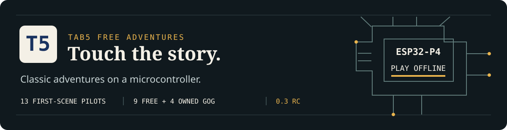
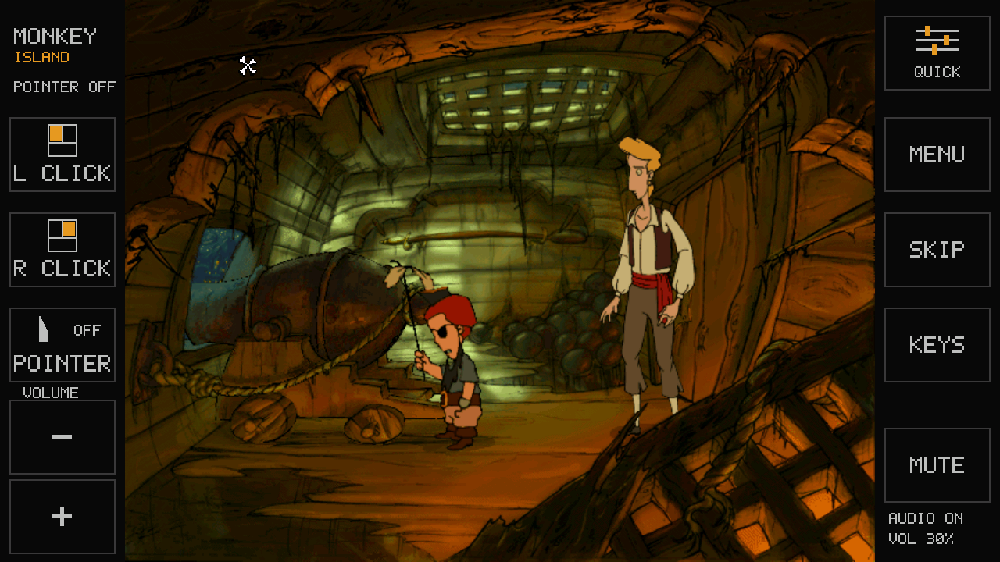
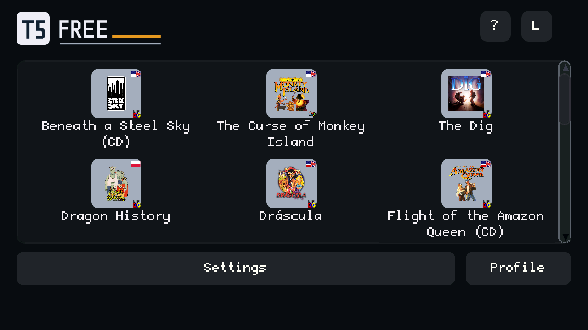
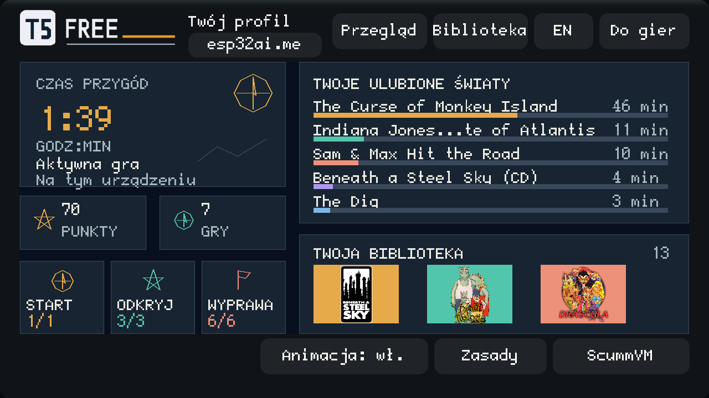

<strong><a href="https://esp32ai.me/pl/tab5adv/">Strona projektu i instalator</a> · <a href="docs/pl/START.md">Zacznij tutaj</a> · <a href="README.md">English</a> · <a href="docs/COMPATIBILITY.md">Zakres testów</a></strong>

# Klasyczne przygody. Jedna mała płytka.

Zamień **M5Stack Tab5** w dotykowy odtwarzacz przygodówek ScummVM.
Wybierz historię, dodaj pliki na microSD przez USB i graj offline — z dużymi
przyciskami po bokach, zapisami, trzema skórkami menu i lokalnym profilem gracza.

**0.3.0-rc2 to wersja testowa.** Trzynaście tytułów dotarło do pierwszych
grywalnych scen na prawdziwym Tab5; sprawdzono wybrane akcje oraz zapis/odczyt.
Pełne przejścia, dłuższa gra palcem i jakość dźwięku nie są jeszcze potwierdzone.
[Tabela zgodności](docs/COMPATIBILITY.md) podaje zakres dla każdej gry.

*Rzeczywisty zrzut LCD. Oryginalna grafika gry; bez makiety rozgrywki i deklaracji FPS.*

| Kolekcja | Na urządzeniu | Na komputerze |
| :--- | :--- | :--- |
| **9 bezpłatnych + 4 z własnych paczek GOG** | Gra offline z microSD | Instalator w Chrome / Edge na komputerze |
| **3 gry po polsku** | L CLICK / R CLICK / POINTER / MENU / SKIP / KEYS | Sprawdzanie dokładnego archiwum i plików gry |
| **Dodatek muzyczny Drásculi** | Lokalne zapisy, czas gry i proste punkty | Pliki gry trafiają prosto do Tab5 przez USB |

## Wybierz historię

Zacznij od bezpłatnej kolekcji. Cztery gry komercyjne wymagają **Twoich własnych
zakupionych paczek GOG**. Repozytorium nie zawiera archiwów gier,
a projekt nie udostępnia ich na swoim serwerze.

| Bezpłatna kolekcja | Język | Własna paczka GOG | Język |
| :--- | :---: | :--- | :---: |
| Beneath a Steel Sky | EN | Sam & Max Hit the Road | EN |
| Flight of the Amazon Queen | EN | Indiana Jones and the Fate of Atlantis | EN |
| Sołtys | PL | The Dig | EN |
| Sfinx | PL | The Curse of Monkey Island | EN |
| Lure of the Temptress | EN | | |
| Teenagent | EN | | |
| Dragon History | PL | | |
| Dráscula + muzyka | EN | | |
| Nippon Safes, Inc. | wybrane EN | | |

<strong>Ile przygody mieści się w kolekcji?</strong>

Około **57 godzin szacowanego czasu oryginalnych historii**, według dostępnych
danych graczy i recenzentów dla 12 z 13 tytułów. Dla Nippona nie mamy wiarygodnej
średniej, więc nie jest doliczony. To nie pomiar przejść na Tab5; wydajność portu
może się różnić. [Czasy poszczególnych gier i źródła](site/game-info.js).

## Od pobrania do pierwszej sceny

1. Przygotuj **Tab5 + microSD FAT32 + kabel USB-C z transmisją danych**.
   Komputer jest potrzebny do instalacji; potem urządzenie gra samodzielnie.
2. Otwórz [instrukcję dla początkujących](docs/pl/START.md) i wgraj firmware.
3. Pobierz jedną z **dokładnie wskazanych paczek**, wybierz ją w instalatorze,
   sprawdź i dodaj przez USB. Mały początek: Sołtys PL albo Lure EN.
4. Dotknij kafelka gry, potem **▶**. **MENU → Return to Launcher** wraca do biblioteki.

Dla GOG wybierz **offline backup installers → macOS → English**, także na Windows.
Strona odczytuje `.pkg`; nie uruchamiasz go. Duże gry mogą kopiować się
kilkadziesiąt minut. Hash potwierdza obsługiwane wydanie, nie własność konta.
Logujesz się tylko na GOG — nie prosimy o jego hasło.

## Twój ekran. Twoje tempo.

| Ekran T5 FREE | Lokalny profil gracza |
| :---: | :---: |
|  |  |
| Skórki Light, Dark i Black. Osobny wybór koloru pasków bocznych. | Czas każdej gry, sesje i punkty za poznawanie tytułów pozostają na microSD. |

**L CLICK / R CLICK to przyciski myszy, nie kierunki chodzenia.** Dotknij miejsca
w scenie, aby tam podejść. **POINTER** wskazuje bez klikania, a **L CLICK / R CLICK**
wykonują akcję w tej pozycji. **KEYS** otwiera klawiaturę. Głośność **− / +** i
**MUTE / UNMUTE** są na bocznych paskach; zwiększanie głośności przy wyciszeniu
nie włącza dźwięku.

**?** otwiera pomoc sterowania podczas gry, z wyborem Polski/English. **POINTER ON/OFF** pokazuje, czy
dotyk tylko wskazuje, czy także klika. Ikony myszy oznaczają przyciski kliknięcia.

Profil liczy aktywną grę, pomija menu/pauzy i zatrzymuje czas po bezczynności.
Punkty nagradzają próbowanie tytułów; nie oznaczają postępu fabuły ani ukończenia.
Wejdziesz przez **Profile**, a **Do gier** wróci do biblioteki.

<strong>Trzy wskazówki przed grą</strong>

- **Curse:** Talk wybierzesz przez **KEYS → t → ✓**. Przytrzymanie pokazuje
  koło czynności; wybór jego gestem wymaga jeszcze potwierdzenia palcem.
- **Nippon:** zapis **KEYS → s → ✓**, odczyt **KEYS → l → ✓**.
  Po restarcie użyj oryginalnej książki **SAVED GAME**, nie skrótu Load z launchera.
- **Dráscula:** włącz POINTER, wskaż czynność, naciśnij L CLICK, potem wskaż
  miejsce/przedmiot i ponownie naciśnij L CLICK.

Pozostałe wskazówki są w [instrukcji sterowania](docs/pl/START.md#sterowanie).

## Co pracuje w środku?

| Sprzęt | Nasze firmware |
| :--- | :--- |
| ESP32-P4, dwa rdzenie RISC-V | Pracuje z częstotliwością **360 MHz** |
| **32 MB PSRAM · 16 MB flash** | Silniki gier, bufor obrazu i lokalny interfejs |
| **Ekran dotykowy 5 cali · poziomo 1280 × 720** | Proporcjonalna scena i przyciski |
| microSD | Dane gier, zapisy, skórki i profil |

Sprawdzona sztuka ma **układ ESP32-P4 rewizji 1.3 i panel ST7123**.
To rewizja układu, nie deklaracja zgodności z każdym wariantem płytki Tab5.
Do grania nie potrzebujesz Wi-Fi ani konta w naszym projekcie.

## Co jest w repozytorium?

- **`site/`** — instalator PL/EN, katalog, prawdziwe zrzuty LCD, wersjonowane
  firmware i pliki pomocnicze oraz metadane źródeł.
- **`manifests/`** — dokładne hashe i listy plików 13 gier oraz muzyki; bez danych gier.
- **`theme/`** — trzy skórki, układy, logo i ich baza upstream.
- **`tools/`** — generatory katalogu/skórek, kontrole hosta i zaawansowany helper USB.
- **`docs/`** — instrukcje startowe, budowanie, zgodność i informacje o wydaniu.

Pasujące źródła firmware są **osobnym plikiem wydania**, zamiast setek megabajtów
w historii Git. Hash i rewizję zapisano w
[BUILD.json](site/releases/v0.3.0-rc2/source/BUILD.json). [Pobierz pasujące źródła](https://github.com/fiedoruk/tab5adv/releases/download/v0.3.0-rc2/tab5adv-source.tar.gz)
z [wydania 0.3 RC](https://github.com/fiedoruk/tab5adv/releases/tag/v0.3.0-rc2).

Paczki gier, zapisy, prywatne nagrania z kamery, kopie urządzenia i notatki
robocze nie trafiają do repo. Firmware nie wysyła telemetrii rozgrywki.
Portal mierzy odsłony i zdarzenia instalatora przez Plausible; nie wysyła
w tych zdarzeniach treści gier ani lokalnego profilu.

## Buduj, zgłaszaj, rozwijaj

[Budowanie](docs/BUILD.md) · [Zgodność i ograniczenia](docs/COMPATIBILITY.md) ·
[Informacje o wydaniu](docs/RELEASE.md) · [Licencje i autorzy](NOTICES.md)

Zgłaszając problem, podaj wersję firmware, grę/wydanie, scenę, czynność i wynik.
Nie dołączaj archiwów gier, danych konta ani prywatnych zapisów. Kyrandia 2,
Mandy, DreamWeb, Frasse i Cubert są poza tym wydaniem 13 tytułów. Sama obecność
silnika ScummVM nie oznacza potwierdzonej zgodności na Tab5.

Projekt oparty na [porcie ESP32 od Espressif](https://github.com/espressif/esp32-scummvm)
i [ScummVM](https://www.scummvm.org/). Kod projektu: GPL-3.0-or-later; elementy
upstream i grafika gier zachowują swoje licencje. Niezależny projekt
społecznościowy, bez oficjalnego poparcia M5Stack, GOG ani ScummVM.
